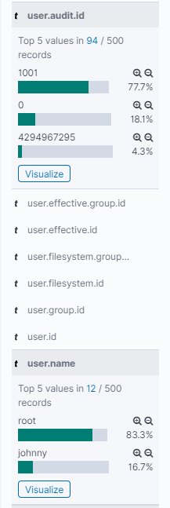

# GitTheGate

Back again for another CyberDefenders post. This is [GitTheGate](https://cyberdefenders.org/labs/40) and I'll work this like the last one, poke around before I answer any questions. The prompt is pretty self-explanatory

```
Overnight we've had an attack on our network, we have two devices in the cloud and it appears both have been compromised.

The attack appears to have taken place on the 25th of May between 9am and 11:30am. Our network is composed of one box that is front facing with an SSH port open to the web and a second server behind it running an old Elastic Stack. Please recover the information requested in these challenges so we can piece together what happened.
```

The instructions are pretty straight forward, download the VM, expand it, run it, and log in. I am using the latest version of VirtualBox and it comes ready to go once you launch it, browse to http://127.0.0.1:5601 and you're off to the races.


## Looking around

Once you access the Kibana homepage, you can see a pretty obvious slice of time we'll be focusign on. It defaults to 2 years ago to ~10 months ago, you can expand around but that's all there is. 


First we check the indexes, and there are a few, `auditbeat-*`, `filebeat-*`, and `kibana_sample_data_logs`. Checkign in the `agent.hostname` field is a good place to start because we can get an idea of what's been reporting logs and what logs they might offer. In this case, we know we have an SSH box and a system running the elastic stack (elasticsearch, kibana, and logstash presumably). 

Since we have a timeline and we know one system, according to the prompt, is web facing, let's start with the ssh box with the search `agent.hostname:sshbox`. If we look at the `user.audit.id` field and the `user.name` field, we might find who has been on the system.





One value sticks out pretty sorely, `4294967295`, and that may or may not be something, just keep it in mind. If we go to the `auditbeat-*` index pattern, we can build a table that's useful for looking at these processes. I'll start with these fields and add more as I think I need them. 


If you go to the very bottom, you see you're limited to 500 events. I wouldn't necessarily make this change in production without testing, but you can go to Kibana settings and see much more. Open the Gear at the left in a new tab `> Advanced settings > Discover > Number of Rows` and set it to 10000. If you scroll down now, you'll see more rows, but this will slow down requests. Toggle the number until you end uip with a nice balance. 

Since we know SSH is exposed, let's find sucessful SSH connections using a query like `agent.hostname:sshbox AND event.dataset:login AND event.outcome:success`. Now let's toggle the source_ip field and add that to our table, we see two IPs, `49.2.23.100` and `134.122.125.130`. The rarer ones are often more interesting, so I'll keep those in mind. 

An extremely useful way to search data in Kibana is to make visualizations. There's a lot to learn here, but getting started is pretty easy and there are resources like [this](https://www.elastic.co/webinars/kibana-101-get-started-with-visualizations) and [this](https://www.elastic.co/guide/en/kibana/current/get-started.html). I launch the visualize tab, created a simple visualization of hosts and process names and generated a table like this. 


Using the table headers to sort the count by reverse order, we find the rare commands, which again, might be interesting since we see things like `cat`, `touch`, `useradd`, and `whoami`, some commands that might imply discovery and creation of users for persistence on the `elk-stack` system. 


So to reinventory what we have, 